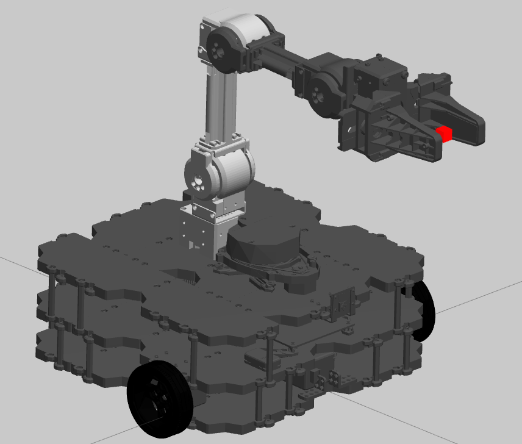

# Mobile Robot with Arm

A ROS 2 mobile manipulation project combining a **TurtleBot3 Waffle Pi mobile base** with a **ROBOTIS OpenMANIPULATOR-X robotic arm and gripper**.

The project is being developed and tested in simulation using **ROS 2 Humble** and **Gazebo Classic** on Ubuntu 22.04.

## Gazebo Simulation



*TurtleBot3 Waffle Pi mobile base integrated with an OpenMANIPULATOR-X arm and gripper in Gazebo Classic.*

## Project Overview

The objective is to develop a mobile manipulator capable of combining:

- Differential-drive mobile navigation
- LiDAR and camera sensing
- Robotic arm control
- Gripper control
- ROS 2 Control
- Gazebo simulation
- Autonomous manipulation and navigation

The robot is being developed incrementally so that each subsystem is validated before higher-level autonomous behaviors are added.

## Current Robot

The simulated platform currently includes:

- TurtleBot3 Waffle Pi mobile base
- Differential-drive wheels
- Rear caster wheels
- 2D LiDAR
- Camera
- IMU
- OpenMANIPULATOR-X
- Two-finger gripper

## Software

- Ubuntu 22.04
- ROS 2 Humble
- Gazebo Classic 11
- Xacro / URDF
- ros2_control
- gazebo_ros2_control
- Python
- CMake

## Development Progress

### Phase 1 — Mobile Base ✅

Completed:

- Recreated TurtleBot3 Waffle Pi mobile base
- Added official-style meshes and robot geometry
- Configured differential-drive wheels
- Added rear caster wheels
- Added LiDAR, camera, and IMU frames
- Added Gazebo differential-drive support
- Verified `/cmd_vel`
- Verified `/odom`
- Stabilized wheel and caster contact physics
- Verified forward and rotational movement

### Phase 2 — OpenMANIPULATOR-X Integration ✅

Completed:

- Integrated ROBOTIS OpenMANIPULATOR-X
- Mounted manipulator to the mobile base
- Relocated LiDAR for manipulator clearance
- Added arm and gripper Gazebo models
- Integrated `gazebo_ros2_control`
- Configured joint state broadcaster
- Configured arm trajectory controller
- Configured gripper controller
- Stabilized robot during manipulator movement
- Verified individual arm joints
- Verified combined arm motion
- Verified gripper open/close operation
- Added automated arm and gripper test

### Next Steps

Planned development includes:

- MoveIt 2 integration
- Motion planning
- Collision-aware arm trajectories
- Navigation integration
- Coordinated mobile base and manipulator operation
- Autonomous pick-and-place tasks

## Repository Structure

```text
mobile_robot_gripper_ws/
├── README.md
├── src/
│   └── mobile_robot_description/
│       ├── launch/
│       │   ├── display.launch.py
│       │   └── gazebo.launch.py
│       ├── meshes/
│       ├── scripts/
│       │   └── arm_gripper_test.py
│       ├── urdf/
│       │   └── mobile_base.urdf.xacro
│       ├── CMakeLists.txt
│       └── package.xml
└── .gitignore
```

## External Dependency

The OpenMANIPULATOR-X description and control configuration are based on the official ROBOTIS TurtleBot3 Manipulation packages.

Clone the ROS 2 Humble branch into the workspace:

```bash
cd ~/mobile_robot_gripper_ws/src

git clone -b humble \
https://github.com/ROBOTIS-GIT/turtlebot3_manipulation.git
```

The external ROBOTIS repository is intentionally excluded from this repository using `.gitignore`.

## Build

From the workspace:

```bash
cd ~/mobile_robot_gripper_ws

colcon build --symlink-install

source install/setup.bash
```

## Launch Gazebo

```bash
ros2 launch mobile_robot_description gazebo.launch.py
```

The launch system starts Gazebo and initializes the robot's controllers.

Verify the controllers with:

```bash
ros2 control list_controllers
```

The following controllers should be active:

```text
joint_state_broadcaster
arm_controller
gripper_controller
```

## Test the Mobile Base

Forward motion:

```bash
ros2 topic pub --once /cmd_vel geometry_msgs/msg/Twist \
"{linear: {x: 0.1}, angular: {z: 0.0}}"
```

Stop:

```bash
ros2 topic pub --once /cmd_vel geometry_msgs/msg/Twist \
"{linear: {x: 0.0}, angular: {z: 0.0}}"
```

## Test the Arm and Gripper

Run:

```bash
ros2 run mobile_robot_description arm_gripper_test.py
```

The test performs a controlled sequence:

1. Moves the arm to a verified stable pose
2. Opens the gripper
3. Closes the gripper
4. Returns the arm to its home position

## ROS Interfaces

Important topics and interfaces currently include:

```text
/cmd_vel
/odom
/joint_states
/arm_controller/joint_trajectory
/gripper_controller/gripper_cmd
```

## Status

**Current milestone:** Mobile base + OpenMANIPULATOR-X simulation and low-level control operational.

The next major development stage is **MoveIt 2 motion planning and manipulation**.

## Author

**Muhammad Ali Sadiq**

Robotics / Mechatronics Engineering
